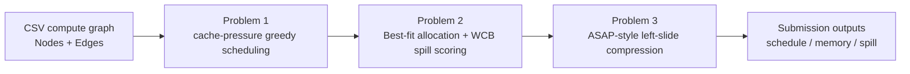

<div align="center">

# 2025 Huaweicup Cache-NPU Scheduling

**Cache-aware scheduling, memory allocation, spill selection, and pipeline compression on DAG-structured compute graphs for SIMD/NPU execution.**

<p>
  <a href="README.md"><b>English</b></a> |
  <a href="README.zh-CN.md">简体中文</a>
</p>

<p>
  <a href="https://github.com/Zysishuiyears/2025Huaweicup_ProA_Cachenpuscheduling"></a>
  
  
  
  
</p>

<p>
  <a href="#installation">Installation</a> |
  <a href="#usage">Usage</a> |
  <a href="#results">Results</a> |
  <a href="#method-overview">Method</a> |
  <a href="#submission-package">Submission Package</a> |
  <a href="#citation">Citation</a>
</p>

</div>

---

This repository studies cache-aware scheduling, memory allocation, spill selection, and pipeline compression for DAG-structured compute graphs on SIMD/NPU-style accelerators.

The project grew out of a 2025 Huawei Cup graduate mathematical modeling competition project, but the abstraction is close to problems encountered in LLM inference runtime and compiler systems. Modern inference workloads are lowered into dependent operator graphs: attention blocks, GEMM-heavy projections, fused elementwise kernels, and data-movement kernels must be placed on a memory hierarchy with limited on-chip capacity. The scheduler therefore has to balance operator readiness, cache residency, DMA traffic, and spill/recompute-style tradeoffs instead of only minimizing a scalar runtime.

The current experiments use the six official SIMD/NPU graph cases from the contest as reproducible proxy workloads. This repository does not claim to benchmark production LLM inference engines; it provides a compact codebase for studying the same class of scheduling and memory-pressure decisions on public graph instances.

The implementation contains a cache-pressure greedy scheduler, a spill-aware memory allocator, and an ASAP-style pipeline compression stage for fine-grained compute graphs.

## News

- `2026-07` Repository reorganized into a GitHub-ready research codebase.
- `2026-07` Added competition-style submission exporter with `Q1_` / `Q2_` / `Q3_` file naming.
- `2026-07` Added mini-case smoke tests and CLI entrypoints for all three problems.

## Problem Abstraction

We study a DAG scheduling problem for fine-grained SIMD/NPU compute graphs. Each graph contains operation nodes and cache-management nodes. The implementation produces a topological execution sequence, assigns contiguous cache addresses, decides SPILL operations when cache capacity is insufficient, and estimates pipeline compression under execution-unit constraints.

From an LLM systems perspective, this is a compact proxy for runtime/compiler decisions that affect prefill and decode throughput: when to execute a ready operator, which intermediate buffers should stay resident in fast memory, when a buffer should be spilled, and how much pipeline slack can be removed without breaking dependencies or execution-unit constraints.

| Stage | Goal | Main output |
| --- | --- | --- |
| Problem 1 | Heuristic topological scheduling under cache-residency pressure and L0 constraints | `Q1_{Case}_schedule.txt` |
| Problem 2 | Best-fit memory allocation with spill-aware victim selection | `Q2_{Case}_schedule.txt`, `memory.txt`, `spill.txt` |
| Problem 3 | ASAP-style conservative left-slide / pipeline compression | `Q3_{Case}_schedule.txt`, `memory.txt`, `spill.txt` |

## Highlights

- Cache-pressure-aware topological scheduling for DAG compute graphs with explicit L0A/L0B/L0C constraints.
- Contiguous multi-pool memory allocation over L1, UB, and L0 buffers, with SPILL victim selection when fast memory is insufficient.
- Three workload families covering attention-like, GEMM-heavy, and convolution/data-movement-heavy execution patterns.
- Competition-style outputs for schedule, memory placement, and spill logs, with canonical submitted results separated from regenerated outputs.
- Unified CLI entrypoints and smoke tests for the three modeling stages and submission-package export.
- `archive/legacy_*` keeps original contest-time scripts, historical outputs, and intermediate versions for reference.

## Installation

### Requirements

- Python >= 3.10
- `pandas`
- `numpy`
- `networkx`
- `matplotlib`
- `pytest` for smoke tests

### Setup

```bash
git clone https://github.com/Zysishuiyears/2025Huaweicup_ProA_Cachenpuscheduling.git
cd 2025Huaweicup_ProA_Cachenpuscheduling

python -m venv .venv
# Windows PowerShell:
.venv\Scripts\Activate.ps1
# macOS / Linux:
# source .venv/bin/activate

pip install -r requirements.txt
```

## Usage

### Quick Smoke Test

Run the built-in 5-node mini case:

```bash
python scripts/runners/run_problem1.py --data-dir data/fixtures/mini_case --case Mini_Case0
python scripts/runners/run_problem2.py --data-dir data/fixtures/mini_case --case Mini_Case0
python scripts/runners/run_problem3.py --data-dir data/fixtures/mini_case --case Mini_Case0
```

Expected output directory:

```text
outputs/reconstructed/
├── problem1/
├── problem2/
└── problem3/
```

### Run One Official Case

```bash
python scripts/runners/run_problem1.py --case FlashAttention_Case0
python scripts/runners/run_problem2.py --case FlashAttention_Case0
python scripts/runners/run_problem3.py --case FlashAttention_Case0
```

### Run All Stages

```bash
python scripts/runners/run_all.py --case FlashAttention_Case0
```

Remove `--case FlashAttention_Case0` to run all six official cases. Full six-case reproduction can take longer on large graphs such as `Conv_Case1`.

### Code Organization

The maintained command-line path is `scripts/runners/`. Core implementations live under `scripts/core/cache_npu_scheduling/` and are imported by the runners.

## Submission Package

If the goal is to generate a competition-style final attachment tree, use the submission scripts instead of manually collecting files.

### Export Canonical Submitted Results

This uses the preserved final competition baseline under `outputs/submission/`:

```bash
python scripts/runners/export_submission.py
```

Output:

```text
outputs/submission_ready/A25100550012/
outputs/submission_ready/A25100550012_submission_ready.zip
```

### Run Current Code and Export

This first runs the cleaned code, then converts generated outputs into the same attachment layout:

```bash
python scripts/runners/run_submission.py
```

For a quick structural check:

```bash
python scripts/runners/run_submission.py --data-dir data/fixtures/mini_case --case Mini_Case0 --package-name MiniSubmission --no-zip
```

### Attachment Layout

```text
A25100550012/
├── Attachment/
│   ├── Problem1/
│   │   └── Q1_{Case}_schedule.txt
│   ├── Problem2/
│   │   ├── Q2_{Case}_schedule.txt
│   │   ├── Q2_{Case}_memory.txt
│   │   └── Q2_{Case}_spill.txt
│   └── Problem3/
│       ├── Q3_{Case}_schedule.txt
│       ├── Q3_{Case}_memory.txt
│       └── Q3_{Case}_spill.txt
└── code/
    ├── problem1_scheduler.py
    ├── problem2_allocator.py
    └── problem3_pipeline.py
```

## Evaluation

### Smoke Tests

```bash
python -m compileall scripts
python -m pytest -q
```

Current smoke tests verify:

- CLI entrypoints for Problem 1 / 2 / 3.
- Mini-case output generation.
- Canonical submission export layout.
- Code-generated submission export layout.

### Official Cases

| Case | Nodes | Edges |
| --- | ---: | ---: |
| `FlashAttention_Case0` | 1,716 | 2,712 |
| `FlashAttention_Case1` | 6,952 | 11,184 |
| `Matmul_Case0` | 4,160 | 7,104 |
| `Matmul_Case1` | 30,976 | 55,040 |
| `Conv_Case0` | 2,580 | 3,869 |
| `Conv_Case1` | 36,086 | 85,653 |

### Workloads and Data Schema

Each official case is stored as `{Case}_Nodes.csv` and `{Case}_Edges.csv`. The node table describes both computation and cache-management events:

| Field | Meaning |
| --- | --- |
| `Id` | Node identifier in the compute DAG |
| `Op` | Operation type, such as `ALLOC`, `FREE`, `MATMUL`, `MUL`, `EXP`, `SUB`, `CONV`, `MOVE`, `COPY_IN`, `COPY_OUT` |
| `BufId`, `Size`, `Type` | Buffer identity, allocation size, and cache pool such as `L1`, `UB`, `L0A`, `L0B`, `L0C` |
| `Pipe`, `Cycles` | Execution unit and estimated latency |
| `Bufs` | Buffers consumed or produced by an operation node |

The workload names correspond to different accelerator execution patterns:

- `FlashAttention`: attention-block style graphs with `MATMUL`, softmax-like vector operations (`MUL`, `SUB`, `EXP`), and frequent UB/L0 interaction. This is the closest case family to LLM attention, where long-sequence execution stresses intermediate residency and data movement.
- `Matmul`: regular GEMM-heavy graphs resembling dense projections, QKV projection, and FFN layers. The graphs are structurally regular but large, making L0 tiling and CUBE pipeline pressure visible.
- `Conv`: convolution-style graphs with dense `MOVE`, `COPY_IN`, and `CONV` interaction. These cases provide a contrast workload where memory movement and compute pipeline coordination dominate.

`Pipe` values expose the hardware execution structure: `CUBE` is used for matrix/convolution compute, `VECTOR` for elementwise and softmax-like operators, `MTE*` for memory transfer, and `FIXP` for auxiliary format or fixed-function work.

## Results

### Canonical Output Inventory

The preserved final submission baseline contains:

| Folder | Content | Files |
| --- | --- | ---: |
| `outputs/submission/problem1/` | Problem 1 schedules | 6 |
| `outputs/submission/problem2/` | Problem 2 schedules, memory maps, spill logs | 18 |
| `outputs/submission/problem3/` | Problem 3 schedules, memory maps, spill logs | 18 |

### Representative Figures

Problem 1 scheduling illustration:

<p align="center">
  
</p>

Parameter scan examples:

| FlashAttention Case0 | Matmul Case0 | Conv Case0 |
| --- | --- | --- |
|  |  |  |

## Method Overview



### Problem 1

The scheduler maintains a ready set of topologically available nodes and ranks them by signed cache pressure:

```text
pressure(v) =
  +Size(v), if v is UB/L1 ALLOC
  -Size(v), if v is UB/L1 FREE
   0,       otherwise
```

At each step it selects the feasible ready node with the smallest pressure, so `FREE` nodes tend to release fast memory early while large `ALLOC` nodes are delayed when possible. L0A/L0B/L0C live allocations are tracked separately; a candidate that would create a second live buffer in the same L0 pool is skipped when another ready node is available.

### Problem 2

Each cache pool maintains used and free intervals. Contiguous placement uses Best-fit:

```text
choose block b with len(b) >= request_size
and minimal remaining space len(b) - request_size
```

If UB/L1 allocation fails, the allocator scans candidate positions and evaluates the buffers that would overlap the requested interval. The victim score is:

```text
score(buf) = copy_coeff(buf) * w1 / size(buf)
           + w2 / remaining_lifetime(buf)
```

The selected position is the one with the lowest total victim score. This preserves the MATCH-style virtual interval sliding idea: choose low-cost victims to open a contiguous region for the current allocation.

### Problem 3

Problem 3 reuses the spill-aware schedule and memory layout, then estimates pipeline compression with a conservative ASAP-style left-slide procedure:

```text
start(v) = max(max(end(u) for u in pred(v)), last_finish(pipe(v)))
end(v)   = start(v) + cycles(v)
```

Nodes are shifted earlier only when dependency and execution-unit constraints remain valid, giving a conservative estimate of how much pipeline slack can be removed.

## Repository Structure

```text
.
├── data/
│   ├── raw/csv/                 # six official CSV graph cases
│   └── fixtures/mini_case/      # small smoke-test case
├── scripts/
│   ├── core/cache_npu_scheduling/ # core implementation
│   └── runners/                   # command-line entrypoints
├── outputs/
│   ├── submission/              # canonical final submission baseline
│   └── reconstructed/           # regenerated outputs, ignored by Git
├── docs/                        # technical note, reconstruction notes, contest materials
├── figures/                     # diagrams and experiment figures
├── tests/                       # smoke tests
└── archive/                     # original packages, legacy scripts, old outputs
```

## TODO List

- [ ] Add stricter topological-validity checks for generated schedules.
- [ ] Add memory interval non-overlap validation for `memory.txt`.
- [ ] Add deterministic full-case reproduction scripts with runtime logs.
- [ ] Separate Problem 3 timing summaries into machine-readable CSV files.
- [ ] Add CI for `compileall`, `pytest`, and submission layout validation.

## Limitations

- The implementation is heuristic code, not a production-grade compiler scheduler.
- No optimality or approximation guarantee is claimed.
- The current tests are smoke tests; they do not replace full algorithmic validation.
- `archive/legacy_*` contains original contest-time scripts and historical outputs for reference; it is not part of the maintained execution path.
- `outputs/submission/` is the canonical competition baseline; `outputs/reconstructed/` is for current-code verification and development.

## AI-Assisted Coding Disclosure

Parts of the original competition code and this repository reconstruction were developed with AI assistance under human direction. AI tools were used for code drafting, refactoring support, documentation, and repository cleanup. The problem interpretation, algorithmic choices, experiment organization, result selection, and final repository decisions are maintained as human-directed work.

## Citation

If you use this project, please cite it using the metadata in `CITATION.cff`.

```bibtex
@software{huaweicup_cache_npu_scheduling_2026,
  title  = {2025 Huaweicup Cache-NPU Scheduling},
  author = {{A25100550012 project contributors}},
  year   = {2026},
  url    = {https://github.com/Zysishuiyears/2025Huaweicup_ProA_Cachenpuscheduling}
}
```

## License

This repository is released under the MIT License. Original contest statements, attachments, and paper materials are preserved for provenance and should be interpreted in their original competition context.
