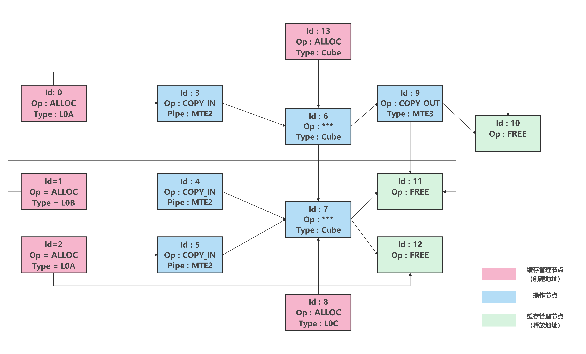
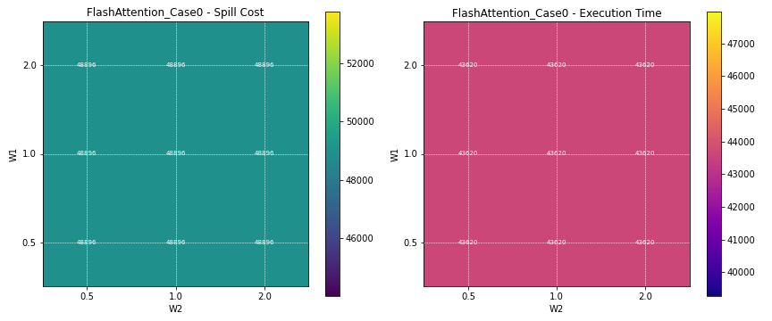
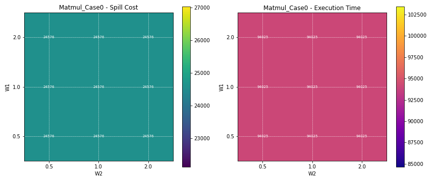
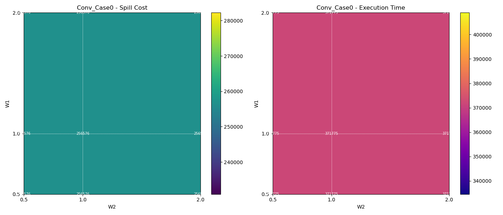
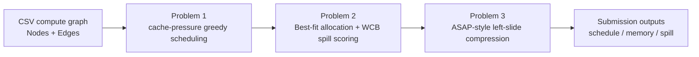

<div align="center">

# 2025 Huaweicup Cache-NPU Scheduling

**Cache-aware scheduling, memory allocation, spill selection, and pipeline compression on DAG-structured compute graphs for SIMD/NPU execution.**

<p>
  <a href="README.md"><b>English</b></a> |
  <a href="README.zh-CN.md">简体中文</a>
</p>

<p>
  <a href="https://github.com/Zysishuiyears/2025Huaweicup_ProA_Cachenpuscheduling"></a>
  
  
  
  
</p>

<p>
  <a href="#installation">Installation</a> |
  <a href="#usage">Usage</a> |
  <a href="#results">Results</a> |
  <a href="#method-overview">Method</a> |
  <a href="#submission-package">Submission Package</a> |
  <a href="#citation">Citation</a>
</p>

</div>

---

This repository is reconstructed from a 2025 Huawei Cup graduate mathematical modeling competition project. It is not a raw dump of the original submission package; it reorganizes the post-competition archive into a runnable, traceable, and maintainable lightweight research artifact.

The artifact includes a heuristic scheduler, a spill-aware memory allocator, and an ASAP-style pipeline compression stage for fine-grained compute graphs on SIMD/NPU-like architectures.

## News

- `2026-07` Repository reconstructed into a GitHub-ready research artifact.
- `2026-07` Added competition-style submission exporter with `Q1_` / `Q2_` / `Q3_` file naming.
- `2026-07` Added mini-case smoke tests and CLI entrypoints for all three problems.

## Problem Abstraction

We study a DAG scheduling problem for fine-grained SIMD/NPU compute graphs. Each graph contains operation nodes and cache-management nodes. The scheduling artifact needs to produce a topological execution sequence, assign contiguous cache addresses, decide SPILL operations when cache capacity is insufficient, and estimate pipeline compression under execution-unit constraints.

| Stage | Goal | Main output |
| --- | --- | --- |
| Problem 1 | Heuristic topological scheduling under cache-residency pressure and L0 constraints | `Q1_{Case}_schedule.txt` |
| Problem 2 | Best-fit memory allocation with spill-aware victim selection | `Q2_{Case}_schedule.txt`, `memory.txt`, `spill.txt` |
| Problem 3 | ASAP-style conservative left-slide / pipeline compression artifact | `Q3_{Case}_schedule.txt`, `memory.txt`, `spill.txt` |

## Highlights

- Cleaned project layout with separated `src/`, `scripts/`, `data/`, `outputs/`, `docs/`, `figures`, and `archive`.
- Official six-case CSV inputs preserved under `data/raw/csv/`.
- Final competition submission outputs preserved under `outputs/submission/` as the canonical baseline.
- Current runnable outputs are written to `outputs/reconstructed/` and are ignored by Git.
- Competition-style attachment export is available through `scripts/export_submission.py` and `scripts/run_submission.py`.
- Legacy scripts and historical outputs are archived instead of deleted.

## Installation

### Requirements

- Python >= 3.10
- `pandas`
- `numpy`
- `networkx`
- `matplotlib`
- `pytest` for smoke tests

### Setup

```bash
git clone https://github.com/Zysishuiyears/2025Huaweicup_ProA_Cachenpuscheduling.git
cd 2025Huaweicup_ProA_Cachenpuscheduling

python -m venv .venv
# Windows PowerShell:
.venv\Scripts\Activate.ps1
# macOS / Linux:
# source .venv/bin/activate

pip install -r requirements.txt
```

## Usage

### Quick Smoke Test

Run the built-in 5-node mini case:

```bash
python scripts/run_problem1.py --data-dir data/fixtures/mini_case --case Mini_Case0
python scripts/run_problem2.py --data-dir data/fixtures/mini_case --case Mini_Case0
python scripts/run_problem3.py --data-dir data/fixtures/mini_case --case Mini_Case0
```

Expected output directory:

```text
outputs/reconstructed/
├── problem1/
├── problem2/
└── problem3/
```

### Run One Official Case

```bash
python scripts/run_problem1.py --case FlashAttention_Case0
python scripts/run_problem2.py --case FlashAttention_Case0
python scripts/run_problem3.py --case FlashAttention_Case0
```

### Run All Stages

```bash
python scripts/run_all.py --case FlashAttention_Case0
```

Remove `--case FlashAttention_Case0` to run all six official cases. Full six-case reproduction can take longer on large graphs such as `Conv_Case1`.

### Direct Module Execution

The package modules can also be executed directly:

```bash
python src/cache_npu_scheduling/problem1_scheduler.py --case FlashAttention_Case0
python src/cache_npu_scheduling/problem2_allocator.py --case FlashAttention_Case0
python src/cache_npu_scheduling/problem3_pipeline.py --case FlashAttention_Case0
```

## Submission Package

If the goal is to generate a competition-style final attachment tree, use the submission scripts instead of manually collecting files.

### Export Canonical Submitted Results

This uses the preserved final competition baseline under `outputs/submission/`:

```bash
python scripts/export_submission.py
```

Output:

```text
outputs/submission_ready/A25100550012/
outputs/submission_ready/A25100550012_submission_ready.zip
```

### Run Current Code and Export

This first runs the cleaned code, then converts generated outputs into the same attachment layout:

```bash
python scripts/run_submission.py
```

For a quick structural check:

```bash
python scripts/run_submission.py --data-dir data/fixtures/mini_case --case Mini_Case0 --package-name MiniSubmission --no-zip
```

### Attachment Layout

```text
A25100550012/
├── Attachment/
│   ├── Problem1/
│   │   └── Q1_{Case}_schedule.txt
│   ├── Problem2/
│   │   ├── Q2_{Case}_schedule.txt
│   │   ├── Q2_{Case}_memory.txt
│   │   └── Q2_{Case}_spill.txt
│   └── Problem3/
│       ├── Q3_{Case}_schedule.txt
│       ├── Q3_{Case}_memory.txt
│       └── Q3_{Case}_spill.txt
└── code/
    ├── problem1_scheduler.py
    ├── problem2_allocator.py
    └── problem3_pipeline.py
```

## Evaluation

### Smoke Tests

```bash
python -m compileall src scripts
python -m pytest -q
```

Current smoke tests verify:

- CLI entrypoints for Problem 1 / 2 / 3.
- Mini-case output generation.
- Canonical submission export layout.
- Code-generated submission export layout.

### Official Cases

| Case | Nodes | Edges |
| --- | ---: | ---: |
| `FlashAttention_Case0` | 1,716 | 2,712 |
| `FlashAttention_Case1` | 6,952 | 11,184 |
| `Matmul_Case0` | 4,160 | 7,104 |
| `Matmul_Case1` | 30,976 | 55,040 |
| `Conv_Case0` | 2,580 | 3,869 |
| `Conv_Case1` | 36,086 | 85,653 |

## Results

### Canonical Output Inventory

The preserved final submission baseline contains:

| Folder | Content | Files |
| --- | --- | ---: |
| `outputs/submission/problem1/` | Problem 1 schedules | 6 |
| `outputs/submission/problem2/` | Problem 2 schedules, memory maps, spill logs | 18 |
| `outputs/submission/problem3/` | Problem 3 schedules, memory maps, spill logs | 18 |

### Representative Figures

Problem 1 scheduling illustration:

<p align="center">
  
</p>

Parameter scan examples:

| FlashAttention Case0 | Matmul Case0 | Conv Case0 |
| --- | --- | --- |
|  |  |  |

## Method Overview



### Problem 1

The scheduler prioritizes nodes by cache-residency pressure: `FREE` nodes reduce UB/L1 pressure, ordinary compute and data-movement nodes are neutral, and `ALLOC` nodes increase pressure. L0A/L0B/L0C live allocations are tracked to avoid violating L0 constraints when feasible alternatives exist.

### Problem 2

Each cache pool maintains used intervals and free intervals. Best-fit allocation is used for contiguous placement. If UB/L1 allocation fails, a WCB-style victim score considers buffer size, remaining lifetime, and copy-in relevance to decide spill candidates.

### Problem 3

The current artifact preserves the final competition behavior: Problem 3 exports the same schedule/memory/spill style as Problem 2 while computing a conservative ASAP-style timing estimate for pipeline compression.

## Repository Structure

```text
.
├── data/
│   ├── raw/csv/                 # six official CSV graph cases
│   └── fixtures/mini_case/      # small smoke-test case
├── src/cache_npu_scheduling/    # reusable package code
├── scripts/                     # command-line entrypoints
├── outputs/
│   ├── submission/              # canonical final submission baseline
│   └── reconstructed/           # regenerated outputs, ignored by Git
├── docs/                        # technical note, reconstruction notes, contest materials
├── figures/                     # diagrams and experiment figures
├── tests/                       # smoke tests
└── archive/                     # original packages, legacy scripts, old outputs
```

## TODO List

- [ ] Add stricter topological-validity checks for generated schedules.
- [ ] Add memory interval non-overlap validation for `memory.txt`.
- [ ] Add deterministic full-case reproduction scripts with runtime logs.
- [ ] Separate Problem 3 timing summaries into machine-readable CSV files.
- [ ] Add CI for `compileall`, `pytest`, and submission layout validation.

## Limitations

- The implementation is a heuristic artifact, not a production-grade compiler scheduler.
- No optimality or approximation guarantee is claimed.
- The current tests are smoke tests; they do not replace full algorithmic validation.
- Some legacy scripts are archived for traceability but are not part of the maintained execution path.
- `outputs/submission/` is the canonical competition baseline; `outputs/reconstructed/` is for current-code verification and development.

## AI-Assisted Coding Disclosure

Parts of the original competition code and this repository reconstruction were developed with AI assistance under human direction. AI tools were used for code drafting, refactoring support, documentation, and repository cleanup. The problem interpretation, algorithmic choices, experiment organization, result selection, and final repository decisions are maintained as human-directed work.

## Citation

If you use this research artifact, please cite it using the metadata in `CITATION.cff`.

```bibtex
@software{huaweicup_cache_npu_scheduling_2026,
  title  = {2025 Huaweicup Cache-NPU Scheduling},
  author = {{A25100550012 project contributors}},
  year   = {2026},
  url    = {https://github.com/Zysishuiyears/2025Huaweicup_ProA_Cachenpuscheduling}
}
```

## License

This repository is released under the MIT License. Original contest statements, attachments, and paper materials are preserved for provenance and should be interpreted in their original competition context.
