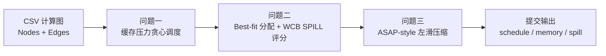

<div align="center">

# 2025 华为杯 Cache-NPU 调度项目

**面向 SIMD/NPU DAG 计算图的缓存感知调度、内存分配、SPILL 选择与流水压缩。**

<p>
  <a href="README.md">English</a> |
  <a href="README.zh-CN.md"><b>简体中文</b></a>
</p>

<p>
  <a href="https://github.com/Zysishuiyears/2025Huaweicup_ProA_Cachenpuscheduling"></a>
  
  
  
  
</p>

<p>
  <a href="#安装">安装</a> |
  <a href="#使用">使用</a> |
  <a href="#结果">结果</a> |
  <a href="#方法概览">方法</a> |
  <a href="#提交附件">提交附件</a> |
  <a href="#引用">引用</a>
</p>

</div>

---

本仓库研究 SIMD/NPU 风格加速器上的 DAG 计算图调度问题，重点包括缓存感知调度、连续内存分配、SPILL 选择和流水压缩。

项目来源于 2025 年“华为杯”中国研究生数学建模竞赛 A 题，但其抽象与 LLM inference runtime / compiler 中的实际问题高度接近。现代 LLM 推理任务通常会被 lower 成带依赖关系的算子图：attention block、GEMM-heavy projection、fused elementwise kernel 和数据搬运 kernel 都需要映射到片上存储容量有限的加速器层次结构上。因此，调度器不仅要考虑算子是否 ready，还要同时权衡缓存驻留、DMA 搬运、SPILL / recompute 类 tradeoff，以及多执行单元流水利用率。

当前实验使用华为杯给定的六个 SIMD/NPU 计算图作为公开、可复现的 proxy workload。本仓库不声称 benchmark 真实生产级 LLM 推理引擎，而是提供一个紧凑代码库，用于研究同一类调度与内存压力决策。

当前代码包含缓存压力贪心调度器、SPILL-aware 内存分配器，以及面向细粒度计算图的 ASAP-style 流水压缩阶段。

## 更新

- `2026-07` 将赛后归档目录整理为 GitHub-ready 研究代码仓库。
- `2026-07` 新增竞赛提交附件导出器，支持 `Q1_` / `Q2_` / `Q3_` 文件命名。
- `2026-07` 新增 mini case smoke tests 和三问独立 CLI 入口。

## 问题抽象

本项目研究细粒度 SIMD/NPU 计算图上的 DAG 调度问题。每个计算图包含操作节点和缓存管理节点。当前实现需要生成拓扑执行序列、分配连续缓存地址、在缓存容量不足时决定 SPILL 操作，并在执行单元约束下估计流水压缩效果。

从 LLM 系统视角看，这可以视为一个紧凑的 runtime / compiler 抽象：在依赖受限的算子 DAG 上安排执行顺序，控制中间张量是否留在 fast memory，决定何时 SPILL，并在不破坏依赖和执行单元约束的前提下压缩流水空隙。这类决策会直接影响 prefill 和 decode 阶段的吞吐与内存占用。

| 阶段 | 目标 | 主要输出 |
| --- | --- | --- |
| 问题一 | 在缓存驻留压力和 L0 约束下生成启发式拓扑调度序列 | `Q1_{Case}_schedule.txt` |
| 问题二 | 使用 Best-fit 分配地址，并进行 SPILL-aware victim 选择 | `Q2_{Case}_schedule.txt`, `memory.txt`, `spill.txt` |
| 问题三 | ASAP-style 保守左滑 / 流水压缩 | `Q3_{Case}_schedule.txt`, `memory.txt`, `spill.txt` |

## 项目亮点

- 面向 DAG 计算图的缓存压力感知拓扑调度，并显式处理 L0A/L0B/L0C 活跃约束。
- 在 L1、UB、L0 等多级缓存池上进行连续地址分配，并在 fast memory 不足时选择 SPILL victim。
- 三类 workload 覆盖 attention-like、GEMM-heavy、卷积 / 数据搬运密集型执行模式。
- 输出包括 schedule、memory placement 和 spill log，并将正式提交基线与当前重跑结果分离，便于复现对照。
- 三问和提交附件导出均提供统一 CLI 入口，并配有 mini case smoke tests。
- `archive/legacy_*` 中包含比赛时的原始脚本、历史输出和中间版本，作为存档参考。

## 安装

### 依赖

- Python >= 3.10
- `pandas`
- `numpy`
- `networkx`
- `matplotlib`
- `pytest`，用于 smoke tests

### 配置环境

```bash
git clone https://github.com/Zysishuiyears/2025Huaweicup_ProA_Cachenpuscheduling.git
cd 2025Huaweicup_ProA_Cachenpuscheduling

python -m venv .venv
# Windows PowerShell:
.venv\Scripts\Activate.ps1
# macOS / Linux:
# source .venv/bin/activate

pip install -r requirements.txt
```

## 使用

### 快速 Smoke Test

运行内置 5 节点 mini case：

```bash
python scripts/runners/run_problem1.py --data-dir data/fixtures/mini_case --case Mini_Case0
python scripts/runners/run_problem2.py --data-dir data/fixtures/mini_case --case Mini_Case0
python scripts/runners/run_problem3.py --data-dir data/fixtures/mini_case --case Mini_Case0
```

默认输出目录：

```text
outputs/reconstructed/
├── problem1/
├── problem2/
└── problem3/
```

### 运行单个官方 Case

```bash
python scripts/runners/run_problem1.py --case FlashAttention_Case0
python scripts/runners/run_problem2.py --case FlashAttention_Case0
python scripts/runners/run_problem3.py --case FlashAttention_Case0
```

### 运行完整流程

```bash
python scripts/runners/run_all.py --case FlashAttention_Case0
```

去掉 `--case FlashAttention_Case0` 后会运行六个官方 case。完整六 case 复现可能耗时较长，尤其是 `Conv_Case1` 等大图。

### 代码组织

建议用户通过 `scripts/runners/` 运行项目。核心实现位于 `scripts/core/cache_npu_scheduling/`，由 runner 统一导入调用。

## 提交附件

如果目标是生成竞赛附件格式，请使用 submission 脚本，不建议手动拼文件。

### 导出正式提交基线

该命令使用 `outputs/submission/` 中保留的最终提交结果：

```bash
python scripts/runners/export_submission.py
```

输出：

```text
outputs/submission_ready/A25100550012/
outputs/submission_ready/A25100550012_submission_ready.zip
```

### 运行当前代码并导出

该命令会先运行整理后的代码，再将生成结果转换为同样的提交附件结构：

```bash
python scripts/runners/run_submission.py
```

快速检查结构：

```bash
python scripts/runners/run_submission.py --data-dir data/fixtures/mini_case --case Mini_Case0 --package-name MiniSubmission --no-zip
```

### 附件结构

```text
A25100550012/
├── Attachment/
│   ├── Problem1/
│   │   └── Q1_{Case}_schedule.txt
│   ├── Problem2/
│   │   ├── Q2_{Case}_schedule.txt
│   │   ├── Q2_{Case}_memory.txt
│   │   └── Q2_{Case}_spill.txt
│   └── Problem3/
│       ├── Q3_{Case}_schedule.txt
│       ├── Q3_{Case}_memory.txt
│       └── Q3_{Case}_spill.txt
└── code/
    ├── problem1_scheduler.py
    ├── problem2_allocator.py
    └── problem3_pipeline.py
```

## 评估

### Smoke Tests

```bash
python -m compileall scripts
python -m pytest -q
```

当前 smoke tests 覆盖：

- 问题一、问题二、问题三的 CLI 入口。
- mini case 输出生成。
- canonical submission 导出结构。
- 当前代码运行后导出的 submission 结构。

### 官方 Case 规模

| Case | 节点数 | 边数 |
| --- | ---: | ---: |
| `FlashAttention_Case0` | 1,716 | 2,712 |
| `FlashAttention_Case1` | 6,952 | 11,184 |
| `Matmul_Case0` | 4,160 | 7,104 |
| `Matmul_Case1` | 30,976 | 55,040 |
| `Conv_Case0` | 2,580 | 3,869 |
| `Conv_Case1` | 36,086 | 85,653 |

### Workloads 与数据字段

每个官方 case 由 `{Case}_Nodes.csv` 和 `{Case}_Edges.csv` 组成。节点表同时描述计算节点和缓存管理节点：

| 字段 | 含义 |
| --- | --- |
| `Id` | 计算图中的节点编号 |
| `Op` | 操作类型，例如 `ALLOC`、`FREE`、`MATMUL`、`MUL`、`EXP`、`SUB`、`CONV`、`MOVE`、`COPY_IN`、`COPY_OUT` |
| `BufId`, `Size`, `Type` | 缓冲区编号、申请大小，以及所属缓存池，例如 `L1`、`UB`、`L0A`、`L0B`、`L0C` |
| `Pipe`, `Cycles` | 执行单元与估计执行周期 |
| `Bufs` | 操作节点读取或写入的缓冲区 |

三类 workload 对应不同的加速器执行模式：

- `FlashAttention`：对应 attention block 风格的计算图，包含 `MATMUL`、softmax-like vector ops（如 `MUL`、`SUB`、`EXP`）以及频繁的 UB/L0 交互。这一类最接近 LLM attention，在长序列场景下会放大中间结果驻留和数据搬运压力。
- `Matmul`：对应 dense projection、QKV projection、FFN 等 GEMM-heavy 负载。图结构更规则，但规模较大，能够体现 L0 tiling 和 CUBE pipeline 压力。
- `Conv`：对应卷积式计算图，包含大量 `MOVE`、`COPY_IN` 和 `CONV` 交错，适合作为 memory movement 与 compute pipeline 协调的对照 workload。

`Pipe` 字段体现硬件执行结构：`CUBE` 用于矩阵乘 / 卷积核心计算，`VECTOR` 用于 elementwise 和 softmax-like 操作，`MTE*` 用于数据搬运，`FIXP` 用于辅助格式处理或固定功能操作。

## 结果

### Canonical 输出清单

保留的正式提交基线包含：

| 目录 | 内容 | 文件数 |
| --- | --- | ---: |
| `outputs/submission/problem1/` | 问题一调度序列 | 6 |
| `outputs/submission/problem2/` | 问题二 schedule、memory、spill | 18 |
| `outputs/submission/problem3/` | 问题三 schedule、memory、spill | 18 |

### 代表性图表

问题一调度示意图：

<p align="center">
  
</p>

参数扫描示例：

| FlashAttention Case0 | Matmul Case0 | Conv Case0 |
| --- | --- | --- |
|  |  |  |

## 方法概览



### 问题一

调度器维护一个拓扑 ready set，并用带符号的缓存压力给候选节点排序：

```text
pressure(v) =
  +Size(v), 如果 v 是 UB/L1 ALLOC
  -Size(v), 如果 v 是 UB/L1 FREE
   0,       其他情况
```

每一步选择压力最小的可行 ready 节点，使 `FREE` 节点倾向于尽早释放 fast memory，而较大的 `ALLOC` 在可能时被延后。L0A/L0B/L0C 的活跃分配单独跟踪；如果某个候选会导致同类 L0 pool 中出现第二个 live buffer，并且还有其他 ready 节点可选，则跳过该候选。

### 问题二

每个缓存池维护已用区间和空闲区间。连续地址分配采用 Best-fit：

```text
选择满足 len(block) >= request_size
且剩余空间 len(block) - request_size 最小的空闲区间
```

若 UB/L1 分配失败，分配器扫描候选位置，并评估会与申请区间重叠的 live buffer。victim score 为：

```text
score(buf) = copy_coeff(buf) * w1 / size(buf)
           + w2 / remaining_lifetime(buf)
```

最终选择总代价最低的位置。该过程保留原项目中的 MATCH 风格虚拟区间滑动思想：通过选择低代价 victim，为当前申请腾出连续区间。

### 问题三

问题三复用 SPILL-aware 调度和内存布局，并使用保守的 ASAP-style 左滑过程估计流水压缩效果：

```text
start(v) = max(max(end(u) for u in pred(v)), last_finish(pipe(v)))
end(v)   = start(v) + cycles(v)
```

只有在依赖约束和执行单元约束仍然满足时，节点才会被提前，因此该结果是对流水空隙可压缩程度的保守估计。

## 仓库结构

```text
.
├── data/
│   ├── raw/csv/                 # 六个官方 CSV 计算图 case
│   └── fixtures/mini_case/      # 小型 smoke-test case
├── scripts/
│   ├── core/cache_npu_scheduling/ # 核心实现
│   └── runners/                   # 命令行入口
├── outputs/
│   ├── submission/              # 正式提交基线
│   └── reconstructed/           # 再生成输出，Git 忽略
├── docs/                        # 技术说明、重构记录、竞赛材料
├── figures/                     # 图示和实验图表
├── tests/                       # smoke tests
└── archive/                     # 原始包、legacy 脚本、旧输出
```

## TODO List

- [ ] 增加更严格的调度序列拓扑合法性检查。
- [ ] 增加 `memory.txt` 地址区间不重叠验证。
- [ ] 增加带运行日志的全 case 确定性复现脚本。
- [ ] 将问题三周期摘要拆分为机器可读 CSV。
- [ ] 增加 CI，覆盖 `compileall`、`pytest` 和 submission layout validation。

## 限制

- 当前实现是启发式代码，不是生产级编译器调度器。
- 不声明全局最优性或近似比保证。
- 当前测试是 smoke tests，不能替代完整算法验证。
- `archive/legacy_*` 中包含比赛时的原始脚本和历史输出，作为存档参考，不属于维护中的执行路径。
- `outputs/submission/` 是竞赛提交基线；`outputs/reconstructed/` 用于当前代码验证和后续开发。

## AI 辅助声明

Parts of the original competition code and this repository reconstruction were developed with AI assistance under human direction. AI tools were used for code drafting, refactoring support, documentation, and repository cleanup. The problem interpretation, algorithmic choices, experiment organization, result selection, and final repository decisions are maintained as human-directed work.

## 引用

如果使用本项目，请参考 `CITATION.cff`。

```bibtex
@software{huaweicup_cache_npu_scheduling_2026,
  title  = {2025 Huaweicup Cache-NPU Scheduling},
  author = {{A25100550012 project contributors}},
  year   = {2026},
  url    = {https://github.com/Zysishuiyears/2025Huaweicup_ProA_Cachenpuscheduling}
}
```

## 许可证

本仓库采用 MIT License。原始竞赛题面、附件和论文材料用于来源追溯，应在其原始竞赛语境下理解。
