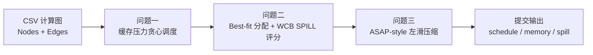

<div align="center">

# 2025 华为杯 Cache-NPU 调度项目

**面向 SIMD/NPU DAG 计算图的缓存感知调度、内存分配、SPILL 选择与流水压缩。**

<p>
  <a href="README.md">English</a> |
  <a href="README.zh-CN.md"><b>简体中文</b></a>
</p>

<p>
  <a href="https://github.com/Zysishuiyears/2025Huaweicup_ProA_Cachenpuscheduling"></a>
  
  
  
  
</p>

<p>
  <a href="#安装">安装</a> |
  <a href="#使用">使用</a> |
  <a href="#结果">结果</a> |
  <a href="#方法概览">方法</a> |
  <a href="#提交附件">提交附件</a> |
  <a href="#引用">引用</a>
</p>

</div>

---

本仓库整理自 2025 年“华为杯”中国研究生数学建模竞赛 A 题项目。它不是原始提交包的简单解压，而是将赛后归档材料重构为一个可运行、可追溯、便于继续研究的 lightweight research artifact。

该 artifact 包含启发式调度器、SPILL-aware 内存分配器，以及面向 SIMD/NPU 细粒度计算图的 ASAP-style 流水压缩阶段。

## 更新

- `2026-07` 将赛后归档目录重构为 GitHub-ready research artifact。
- `2026-07` 新增竞赛提交附件导出器，支持 `Q1_` / `Q2_` / `Q3_` 文件命名。
- `2026-07` 新增 mini case smoke tests 和三问独立 CLI 入口。

## 问题抽象

本项目研究细粒度 SIMD/NPU 计算图上的 DAG 调度问题。每个计算图包含操作节点和缓存管理节点。调度 artifact 需要生成拓扑执行序列、分配连续缓存地址、在缓存容量不足时决定 SPILL 操作，并在执行单元约束下估计流水压缩效果。

| 阶段 | 目标 | 主要输出 |
| --- | --- | --- |
| 问题一 | 在缓存驻留压力和 L0 约束下生成启发式拓扑调度序列 | `Q1_{Case}_schedule.txt` |
| 问题二 | 使用 Best-fit 分配地址，并进行 SPILL-aware victim 选择 | `Q2_{Case}_schedule.txt`, `memory.txt`, `spill.txt` |
| 问题三 | ASAP-style 保守左滑 / 流水压缩 artifact | `Q3_{Case}_schedule.txt`, `memory.txt`, `spill.txt` |

## 项目亮点

- 清理后的工程结构，明确分离 `src/`、`scripts/`、`data/`、`outputs/`、`docs/`、`figures` 和 `archive`。
- 六个官方 CSV case 保存在 `data/raw/csv/`。
- 最终竞赛提交结果保存在 `outputs/submission/`，作为 canonical baseline。
- 当前代码重新运行结果写入 `outputs/reconstructed/`，并被 Git 忽略。
- 通过 `scripts/export_submission.py` 和 `scripts/run_submission.py` 导出竞赛附件格式。
- legacy 脚本和历史输出被归档保留，而不是直接删除。

## 安装

### 依赖

- Python >= 3.10
- `pandas`
- `numpy`
- `networkx`
- `matplotlib`
- `pytest`，用于 smoke tests

### 配置环境

```bash
git clone https://github.com/Zysishuiyears/2025Huaweicup_ProA_Cachenpuscheduling.git
cd 2025Huaweicup_ProA_Cachenpuscheduling

python -m venv .venv
# Windows PowerShell:
.venv\Scripts\Activate.ps1
# macOS / Linux:
# source .venv/bin/activate

pip install -r requirements.txt
```

## 使用

### 快速 Smoke Test

运行内置 5 节点 mini case：

```bash
python scripts/run_problem1.py --data-dir data/fixtures/mini_case --case Mini_Case0
python scripts/run_problem2.py --data-dir data/fixtures/mini_case --case Mini_Case0
python scripts/run_problem3.py --data-dir data/fixtures/mini_case --case Mini_Case0
```

默认输出目录：

```text
outputs/reconstructed/
├── problem1/
├── problem2/
└── problem3/
```

### 运行单个官方 Case

```bash
python scripts/run_problem1.py --case FlashAttention_Case0
python scripts/run_problem2.py --case FlashAttention_Case0
python scripts/run_problem3.py --case FlashAttention_Case0
```

### 运行完整流程

```bash
python scripts/run_all.py --case FlashAttention_Case0
```

去掉 `--case FlashAttention_Case0` 后会运行六个官方 case。完整六 case 复现可能耗时较长，尤其是 `Conv_Case1` 等大图。

### 直接运行模块

包内模块也可以直接执行：

```bash
python src/cache_npu_scheduling/problem1_scheduler.py --case FlashAttention_Case0
python src/cache_npu_scheduling/problem2_allocator.py --case FlashAttention_Case0
python src/cache_npu_scheduling/problem3_pipeline.py --case FlashAttention_Case0
```

## 提交附件

如果目标是生成竞赛附件格式，请使用 submission 脚本，不建议手动拼文件。

### 导出正式提交基线

该命令使用 `outputs/submission/` 中保留的最终提交结果：

```bash
python scripts/export_submission.py
```

输出：

```text
outputs/submission_ready/A25100550012/
outputs/submission_ready/A25100550012_submission_ready.zip
```

### 运行当前代码并导出

该命令会先运行整理后的代码，再将生成结果转换为同样的提交附件结构：

```bash
python scripts/run_submission.py
```

快速检查结构：

```bash
python scripts/run_submission.py --data-dir data/fixtures/mini_case --case Mini_Case0 --package-name MiniSubmission --no-zip
```

### 附件结构

```text
A25100550012/
├── Attachment/
│   ├── Problem1/
│   │   └── Q1_{Case}_schedule.txt
│   ├── Problem2/
│   │   ├── Q2_{Case}_schedule.txt
│   │   ├── Q2_{Case}_memory.txt
│   │   └── Q2_{Case}_spill.txt
│   └── Problem3/
│       ├── Q3_{Case}_schedule.txt
│       ├── Q3_{Case}_memory.txt
│       └── Q3_{Case}_spill.txt
└── code/
    ├── problem1_scheduler.py
    ├── problem2_allocator.py
    └── problem3_pipeline.py
```

## 评估

### Smoke Tests

```bash
python -m compileall src scripts
python -m pytest -q
```

当前 smoke tests 覆盖：

- 问题一、问题二、问题三的 CLI 入口。
- mini case 输出生成。
- canonical submission 导出结构。
- 当前代码运行后导出的 submission 结构。

### 官方 Case 规模

| Case | 节点数 | 边数 |
| --- | ---: | ---: |
| `FlashAttention_Case0` | 1,716 | 2,712 |
| `FlashAttention_Case1` | 6,952 | 11,184 |
| `Matmul_Case0` | 4,160 | 7,104 |
| `Matmul_Case1` | 30,976 | 55,040 |
| `Conv_Case0` | 2,580 | 3,869 |
| `Conv_Case1` | 36,086 | 85,653 |

## 结果

### Canonical 输出清单

保留的正式提交基线包含：

| 目录 | 内容 | 文件数 |
| --- | --- | ---: |
| `outputs/submission/problem1/` | 问题一调度序列 | 6 |
| `outputs/submission/problem2/` | 问题二 schedule、memory、spill | 18 |
| `outputs/submission/problem3/` | 问题三 schedule、memory、spill | 18 |

### 代表性图表

问题一调度示意图：

<p align="center">
  
</p>

参数扫描示例：

| FlashAttention Case0 | Matmul Case0 | Conv Case0 |
| --- | --- | --- |
|  |  |  |

## 方法概览



### 问题一

调度器以缓存驻留压力作为节点优先级：`FREE` 节点降低 UB/L1 驻留压力，普通计算和数据搬运节点为中性，`ALLOC` 节点增加压力。调度过程中跟踪 L0A/L0B/L0C 活跃分配，在存在可行候选时避免违反 L0 约束。

### 问题二

每个缓存池维护已用区间和空闲区间。连续地址分配采用 Best-fit。若 UB/L1 分配失败，则使用 WCB-style victim score，综合缓冲区大小、剩余生命周期和 copy-in 相关性选择 SPILL 候选。

### 问题三

当前 artifact 保留最终提交行为：问题三导出与问题二同类的 schedule / memory / spill 文件，同时计算保守 ASAP-style 周期估计，用于描述流水压缩效果。

## 仓库结构

```text
.
├── data/
│   ├── raw/csv/                 # 六个官方 CSV 计算图 case
│   └── fixtures/mini_case/      # 小型 smoke-test case
├── src/cache_npu_scheduling/    # 可复用包代码
├── scripts/                     # 命令行入口
├── outputs/
│   ├── submission/              # 正式提交基线
│   └── reconstructed/           # 再生成输出，Git 忽略
├── docs/                        # 技术说明、重构记录、竞赛材料
├── figures/                     # 图示和实验图表
├── tests/                       # smoke tests
└── archive/                     # 原始包、legacy 脚本、旧输出
```

## TODO List

- [ ] 增加更严格的调度序列拓扑合法性检查。
- [ ] 增加 `memory.txt` 地址区间不重叠验证。
- [ ] 增加带运行日志的全 case 确定性复现脚本。
- [ ] 将问题三周期摘要拆分为机器可读 CSV。
- [ ] 增加 CI，覆盖 `compileall`、`pytest` 和 submission layout validation。

## 限制

- 当前实现是启发式 artifact，不是生产级编译器调度器。
- 不声明全局最优性或近似比保证。
- 当前测试是 smoke tests，不能替代完整算法验证。
- 部分 legacy 脚本仅用于追溯，不属于维护中的执行路径。
- `outputs/submission/` 是竞赛提交基线；`outputs/reconstructed/` 用于当前代码验证和后续开发。

## AI 辅助声明

Parts of the original competition code and this repository reconstruction were developed with AI assistance under human direction. AI tools were used for code drafting, refactoring support, documentation, and repository cleanup. The problem interpretation, algorithmic choices, experiment organization, result selection, and final repository decisions are maintained as human-directed work.

## 引用

如果使用本 research artifact，请参考 `CITATION.cff`。

```bibtex
@software{huaweicup_cache_npu_scheduling_2026,
  title  = {2025 Huaweicup Cache-NPU Scheduling},
  author = {{A25100550012 project contributors}},
  year   = {2026},
  url    = {https://github.com/Zysishuiyears/2025Huaweicup_ProA_Cachenpuscheduling}
}
```

## 许可证

本仓库采用 MIT License。原始竞赛题面、附件和论文材料用于来源追溯，应在其原始竞赛语境下理解。
